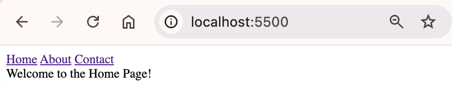
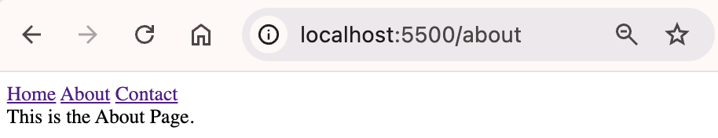
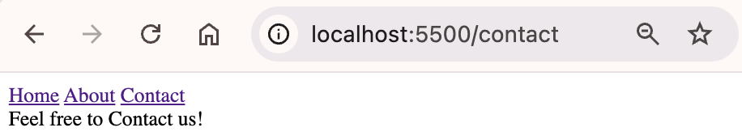

### Project Overview

This is an example of building a single page application(SPA) from scratch without using any libraries.

- There are three routes: Home, About, and Contact.
- Clicking on a link changes the URL and dynamically renders the content.
- Clicking the back or forward button also changes the URL and dynamically renders the content.
- You can find more details in [this article](https://medium.com/@dahee_ahn_/build-a-single-page-application-from-scratch-without-using-any-library-f6397f561a78).

### Getting Started

Active Live Server in your IDE to utilize the History API and prevent CORS issues.

### Images

